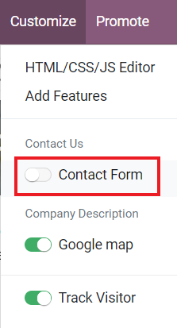
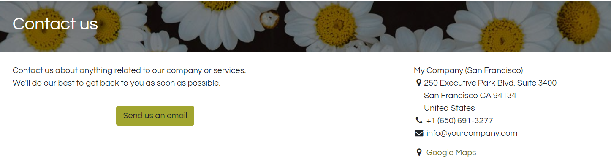
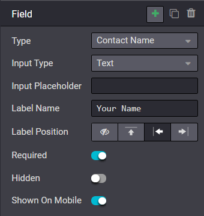

==========================================================
Generate leads/opportunities using a website contact page
==========================================================

Any visitor who uses your website’s contact form will create a lead/opportunity in your pipeline.
This feature can be accessed through the Website application installed on your database.

Use the contact us on your website
==================================

By default, the *Contact Us* page will have your company’s stored information as well as Odoo’s
ready-to-use contact form on your website to automatically generate leads/opportunities.

.. image:: generate_from_website/default-contact-us-page.png
   :align: center
   :alt: Default Contact Us Form

This can be activated or deactivated at any time by going to :menuselection:`Customize -->
Contact Form` on your website and toggling the option on or off.

When the form is toggled off, the *Contact Us* page will have a message letting customers know
that your company accepts email contact and a send now button.

To change the form to a specific sales channel, go to :menuselection:`Website --> Configuration -->
Settings.` Under *Communication,* you will find where to change which *Sales Team* or
*Salesperson* will be assigned to any incoming leads or opportunities from your Contact Form.

.. image:: generate_from_website/contact-form-settings.png
   :align: center
   :alt: Contact Form Settings

Creating a custom contact form
==============================

Wanting more info from visitors using the contact form? Contact forms can be customized for the
specific information your team needs because they can generate multiple types of records in the
system, such as emails, leads/opportunities, project tasks, helpdesk tickets, and more.

Form configuration
==================

The free *Form Builder* module can be installed from either the apps page or automatically when
added to a page in the Website Builder. Adding a whole new form can be great if you are
soliciting certain information that needs filtering, such as suggestions, bug reports, etc.

.. image:: generate_from_website/form-building-blocks.png
   :align: center
   :alt: Form Builder Building Blocks

However, if editing the available predefined options is all that’s necessary, editing the Contact
Form itself is the best option.

.. note::
    This module is only available in Odoo Enterprise.

Editing contact form fields
---------------------------
In edit mode, click on the field to change, and you can edit any of the following information for
the specific field:
- **Type**: Choose a custom field option or an existing field. Examples include phone, file
upload, language, etc.
- **Input Type**: This determines the type of entry customers should input. Available options are
text, email, telephone, and URL.
- **Label Name**: Type in the display name to show users what information is needed from them.
- **Label Position**: Choose the way the label is aligned with the rest of the form. The label
can be hidden, above the field, to the far left of the field, or right adjusted and closer to the
field.
- **Required**: Toggleable option for information that you absolutely need entered
- **Hidden**: Toggleable option to hide the given field for this form or not
- **Shown on Mobile**: Toggleable option to show the field to users on mobile devices.

By default, any new contact form will send an email. You can change this to lead/opportunity
generation in edit mode by clicking any of the form’s fields, and under the form options,
selecting **Create an Opportunity** as the action.

.. note::
    If leads are activated in your CRM settings, selecting **Create an Opportunity** will generate
    a lead.

Generate leads instead of opportunities
=======================================

When using a contact form, you should use a qualification step
by activating *Leads* in CRM settings and refer to :doc:`../sales/crm/acquire_leads/convert`.
